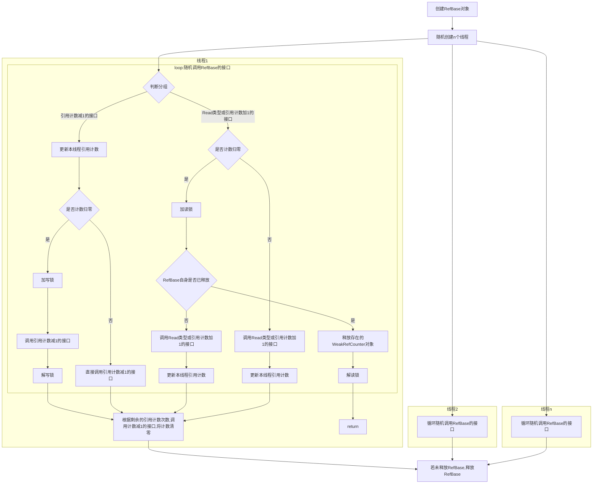

# c_utils基础库fuzzy测试


## 简介

使用Fuzzing测试框架，将自动生成的随机数据输入到测试程序中，监视程序异常崩溃，以发现可能的程序错误。

## fuzz用例设计说明
### Parcel模块用例设计说明
Parcel模块的接口分为3组：
- 普通接口——内存地址对齐的接口;
- 非对齐接口——内存地址不对齐的接口;
- 其他接口——设置parcel数据大小相关的接口。

各组之间的接口互斥，不能在一次测试中同时调用。测试设置300秒时限，在时限内会反复调用用例入口函数，每轮测试首先随机选择一组，然后在组内循环随机调用接口若干次，以确保接口的调用顺序和调用次数的随机性。

### RefBase模块用例设计说明
测试设置300秒时限，在时限内会反复调用用例入口函数，每轮测试创建多个线程，各个线程随机调用RefBase的接口，确保多线程下使用的稳定性。
#### 测试流程

#### 测试说明
结构体SingleThreadCount记录单个线程内部的强弱引用计数情况：

| 变量                                   | 描述                                                         |
| -------------------------------------- | ------------------------------------------------------------ |
| **size_t** strongCount = 0;            | 强引用计数，DecStrongRef、IncStrongRef、AttemptIncStrongRef等会影响该计数。 |
| **size_t** weakCount = 0;              | 弱引用计数，DecWeakRef、IncWeakRef会影响该计数。               |
| **bool** weakRefCounterExists = false; | 是否创建了WeakRefCounter对象。                                 |
| **size_t** weakRefCount = 0;           | WeakRefCounter造成的弱引用计数加减，DecWeakRefCount、IncWeakRefCount会影响该计数。 |

由于RefBase及其成员RefCounter会在所有线程引用计数归零时自动释放，所以各个线程在不知道其它线程引用计数的情况下，需要在自身计数即将归零时加锁，确保RefBase和其成员RefCounter释放的过程中其它线程不会进行有关操作。

此外，attempIncStrongRef、AttemptIncStrong、AttemptAcquire、IncStrongRef之间需要加另一套锁，避免多个线程同时调用的情况下出现强引用计数异常。

### Timer模块用例设计说明
测试设置300秒时限，在时限内会反复调用用例入口函数，每轮测试内部循环多次，每次循环首先设置计时器，然后随机组合调用Register和Unregister函数，每次调用Register时随机设置回调响应时间并随机sleep一段时间，使回调响应随机执行，最后关闭计时器。

## 编译构建
### 编译fuzz测试程序
```
./build.sh --product-name rk3568 --build-target commonlibrary/c_utils/base/test/fuzztest
```

## 目录

```
fuzztest/
├── parcel_fuzzer/
    ├── corpus                        # Fuzz语料目录
    │   ├── init                      # Fuzz语料
    ├── BUILD.gn                      # Parcel模块的Fuzz用例编译配置
    ├── parcel_fuzzer.cpp             # Parcel模块的Fuzz用例源文件
    ├── parcel_fuzzer.h               # Parcel模块的Fuzz用例头文件
    ├── project.xml                   # Parcel模块的Fuzz选项配置文件
├── refbase_fuzzer/
    ├── corpus                        # Fuzz语料目录
    │   ├── init                      # Fuzz语料
    ├── BUILD.gn                      # RefBase模块的Fuzz用例编译配置
    ├── refbase_fuzzer.cpp            # RefBase模块的Fuzz用例源文件
    ├── refbase_fuzzer.h              # RefBase模块的Fuzz用例头文件
    ├── project.xml                   # RefBase模块的Fuzz选项配置文件
├── timer_fuzzer/
    ├── corpus                        # Fuzz语料目录
    │   ├── init                      # Fuzz语料
    ├── BUILD.gn                      # Timer模块的Fuzz用例编译配置
    ├── timer_fuzzer.cpp              # Timer模块的Fuzz用例源文件
    ├── timer_fuzzer.h                # Timer模块的Fuzz用例头文件
    ├── project.xml                   # Timer模块的Fuzz选项配置文件
├── BUILD.gn                          # c_utils库Fuzz整体编译配置
├── fuzz_log.h                        # Fuzz用例调试log头文件
```

