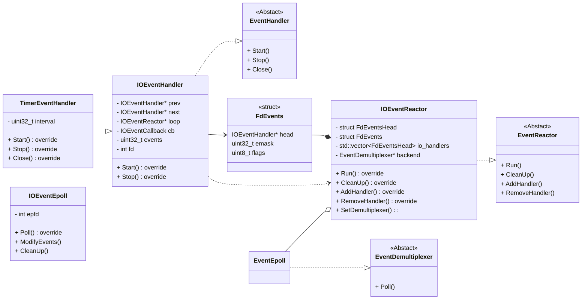
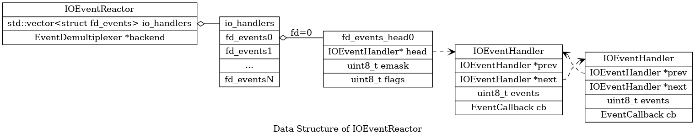

# 事件处理系统
## 概述
事件处理系统。c_utils提供基于Reactor模式，以epoll为后台多路复用机制，通过文件描述符fd实现对各I/O设备的基于事件的异步处理机制。

开发者通过构造事件描述对象(`IOEventHandler`),指定由Fd指定的被监听I/O设备(不支持普通文件)、具体监听的事件类型以及捕获目标事件后的响应行为(回调函数)。

随后开发者需要构造事件处理系统的中心响应器对象(`IOEventReactor`),该中心响应器对象将根据对监听事件以及响应行为的描述，捕获目标事件并对事件进行响应。

## 相关原理

### UML类图

### IOEventReactor内数据结构


### 

## 涉及功能
### OHOS::Utils::Events
#### 描述
```cpp
namespace OHOS::Utils::Events;
```
命名空间`Events`包含了c_utils中事件处理器功能中各兴趣事件的事件类型。

`#include <io_event_common.h>`

同时`io_event_common.h`头文件中定义了表示事件类型的C++类型`EventId`、表示响应行为的C++类型`EventCallback`(即`std::function<void()>`)。
#### 属性

|                | 名称           |
| -------------- | -------------- |
| constexpr EventId | **EVENT_CLOSE** <br>关闭事件。表明当前事件监听“关闭”事件。  |
| constexpr EventId | **EVENT_ERROR** <br>错误事件。表明当前事件监听“错误”事件。  |
| constexpr EventId | **EVENT_INVALID** <br>非法事件。表明当前事件类型设置非法。  |
| constexpr EventId | **EVENT_NONE** <br>空事件。表明当前事件不监听任何事件类型。  |
| constexpr EventId | **EVENT_READ** <br>可读事件。表明当前事件监听“可读”事件。  |
| constexpr EventId | **EVENT_WRITE** <br>可写事件。表明当前事件监听“可写”事件。  |

### OHOS::Utils::IOEventHandler
#### 描述
```cpp
class OHOS::Utils::IOEventHandler;
```
事件描述类。其描述了兴趣IO事件的具体事件类型以及具体响应行为。
当事件系统捕获到响应类型的事件时，将按照该事件描述类对象中定义的响应行为进行响应。

`#include <io_event_handler.h>`

#### 公共成员函数

| 返回类型       | 名称           |
| -------------- | -------------- |
| | **IOEventHandler**()<br>默认构造函数。其Fd为-1。  |
| | **IOEventHandler**(const IOEventHandler && ) =delete |
| | **IOEventHandler**(const IOEventHandler & ) =delete |
| | **IOEventHandler**(int fd, EventId events =Events::EVENT_NONE, const EventCallback & cb =nullptr)<br>有参构造函数。需要显示指定Fd。  |
| virtual | **~IOEventHandler**() |
| void | **DisableAll**()<br>关闭所有事件监听。  |
| void | **DisableWrite**()<br>关闭对“可写”事件的监听。  |
| void | **EnableRead**()<br>开启对“可读”事件的监听。  |
| void | **EnableWrite**()<br>开启对“可写”事件的监听。  |
| EventCallback | **GetCallback**() const |
| EventId | **GetEvents**() const |
| int | **GetFd**() const |
| bool | **IsActive**()<br>返回当前事件是否已启动。  |
| IOEventHandler * | **Next**() const<br>获取链表中后一个事件的指针。  |
| IOEventHandler & | **operator=**(const IOEventHandler && ) =delete |
| IOEventHandler & | **operator=**(const IOEventHandler & ) =delete |
| IOEventHandler * | **Prev**() const<br>获取链表中前一个事件的指针。  |
| void | **SetCallback**(const EventCallback & cb)<br>设置具体响应行为/回调函数  |
| void | **SetEvents**(EventId events)<br>设置被监听事件类型。  |
| void | **SetFd**(int fd)<br>设置被监听对象Fd。  |
| bool | **Start**(IOEventReactor * reactor)<br>启动当前事件监听。  |
| bool | **Stop**(IOEventReactor * reactor)<br>停止当前事件监听  |
| bool | **Update**(IOEventReactor * reactor)<br>更新当前事件状态。当指定事件类型、响应行为变化时需要对其进行更新。  |

### OHOS::Utils::IOEventReactor
#### 描述
```cpp
class OHOS::Utils::IOEventReactor;
```
事件响应器类。其作为事件处理系统的中心调度器，负责管理外部添加的各个事件描述，按照描述添加对事件的监听、对各被监听对象进行轮询并对事件进行分发并处理。

`#include <io_event_reactor.h>`

#### 公共成员函数

| 返回类型       | 名称           |
| -------------- | -------------- |
| | **IOEventHandler**()<br>默认构造函数。其Fd为-1。  |
| | **IOEventHandler**(const IOEventHandler && ) =delete |
| | **IOEventHandler**(const IOEventHandler & ) =delete |
| | **IOEventHandler**(int fd, EventId events =Events::EVENT_NONE, const EventCallback & cb =nullptr)<br>有参构造函数。需要显示指定Fd。  |
| virtual | **~IOEventHandler**() |
| void | **DisableAll**()<br>关闭所有事件监听。  |
| void | **DisableWrite**()<br>关闭对“可写”事件的监听。  |
| void | **EnableRead**()<br>开启对“可读”事件的监听。  |
| void | **EnableWrite**()<br>开启对“可写”事件的监听。  |
| EventCallback | **GetCallback**() const |
| EventId | **GetEvents**() const |
| int | **GetFd**() const |
| bool | **IsActive**()<br>返回当前事件是否已启动。  |
| IOEventHandler * | **Next**() const<br>获取链表中后一个事件的指针。  |
| IOEventHandler & | **operator=**(const IOEventHandler && ) =delete |
| IOEventHandler & | **operator=**(const IOEventHandler & ) =delete |
| IOEventHandler * | **Prev**() const<br>获取链表中前一个事件的指针。  |
| void | **SetCallback**(const EventCallback & cb)<br>设置具体响应行为/回调函数  |
| void | **SetEvents**(EventId events)<br>设置被监听事件类型。  |
| void | **SetFd**(int fd)<br>设置被监听对象Fd。  |
| bool | **Start**(IOEventReactor * reactor)<br>启动当前事件监听。  |
| bool | **Stop**(IOEventReactor * reactor)<br>停止当前事件监听  |
| bool | **Update**(IOEventReactor * reactor)<br>更新当前事件状态。当指定事件类型、响应行为变化时需要对其进行更新。  |

## 使用示例

1. 使用方法(伪代码)

```c++
// IOEventHandler 可以按照业务需要进行继承拓展。如以针对linux底层timerfd定时器为例：
class TimerFdHandler : public IOEventHandler {
public:
    using TimerEventCallback = std::function<void()>;
    TimerFdHandler(int fd, const TimerEventCallback& cb);
    ~TimerFdHandler() {}
    bool Initialize(uint32_t interval);
    void Uninitialize();
    void TimeOut();

private:
    TimerEventCallback timerCallback_;
};
```

```c++
    // 1. 首先创建定时器获取其Fd。
    int fd = timerfd_create(CLOCK_MONOTONIC, TFD_NONBLOCK | TFD_CLOEXEC);

    // 2. 创建IOEventHandler对象，对目标事件进行描述
    std::shared_ptr<TimerFdHandler> handler = std::make_shared<TimerFdHandler>(fd, &TimerCallback1);

    // 3. 创建IOEventReactor响应器对象，启动并使能其事件响应能力。
    std::unique_ptr<IOEventReactor> reactor = std::make_unique<IOEventReactor>();
    ASSERT_EQ(reactor->SetUp(), EVENT_SYS_ERR_OK);
    reactor->EnableHandling();

    // 4. 根据业务需要，对IOEventHandler对象进行其他初始化操作。本例中是设置定时器的超时时间，定时器超时后会抛出"可读"事件，该事件可被捕获从而使响应器对其进行响应。
    handler->Initialize(10);

    // 5. 启动IOEventHandler对象(也可以使用IOEventReactor::AddHandler 方法启动)
    handler->Start(reactor.get());

    // 6. 开启事件处理循环，`Run(int timeout)`方法使响应器循环进行事件处理，具体包括捕获事件以及对事件的响应过程。
    std::thread loopThread([&reactor]{
        reactor->Run(-1);
    });

    // 7. 定时器超时需要10ms，适当等待事件触发
    std::this_thread::sleep_for(std::chrono::milliseconds(16));

    // 8. 确定响应结果， 本例中指定的响应行为 `&TimerCallback1`将对`g_data`加一，故可确定`g_data`的值判断是否响应成功。
    // EXPECT_GE(g_data, 1);

    // 9. 终止事件处理循环，`Terminate()`方法将使`Run()`方法退出，从而新线程执行完毕。
    reactor->Terminate();
    loopThread.join();

    // 10. 事件描述对象生命周期结束时，会从当前响应器对象中移除，从而解除监听。响应器对象生命周期结束时，会清空当前注册的事件描述对象。
    // Notes：尽管事件描述对象生命周期结束时会自动被移除，但手动停止事件描述对象能够提升运行效率，这是因为事件描述对象由于周期结束而被移除时，响应器对象将不会解除其注册的监听事件，该事件仍有可能被响应器捕获。

    // 11. 所以这里手动停止事件描述对象。
    handler->Stop(reactor.get());
```

2. 测试用例编译运行方法

- 测试用例代码参见 base/test/unittest/common/utils_event_test.cpp

- 使用开发者自测试框架，使用方法参见：[开发自测试执行框架-测试用例执行](https://gitee.com/openharmony/testfwk_developer_test#%E6%B5%8B%E8%AF%95%E7%94%A8%E4%BE%8B%E6%89%A7%E8%A1%8C)

- 使用以下具体命令以运行事件处理系统对应测试用例

```bash
run -t UT -tp utils -ts UtilsEventTest
```