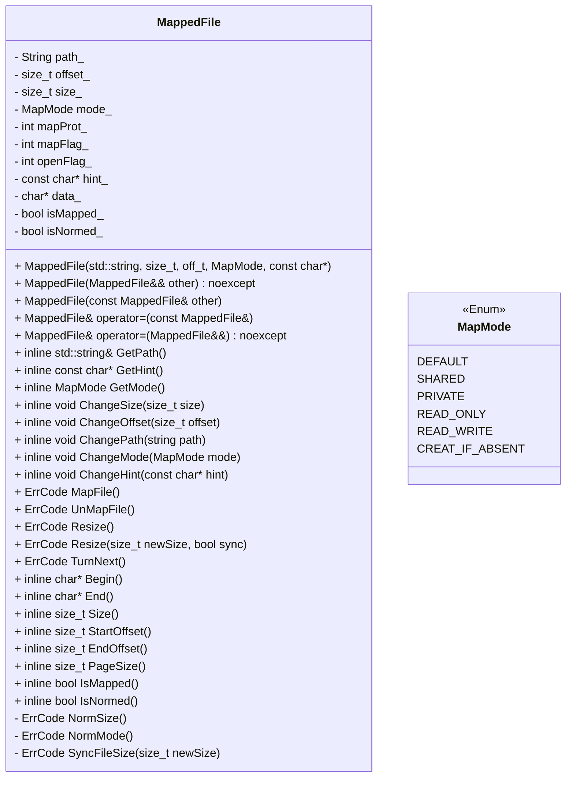

# 文件映射
## 概述

文件映射功能。c_utils提供基于文件(file-backed)的内存映射。其将文件映射至进程的地址空间中，从而支持通过文件映射后的地址对文件进行读写操作。
文件映射能够节省时间以及空间开销。此外，文件映射也可以支持跨进程的信息共享。

## 涉及功能


### OHOS::Utils::MapMode
#### 描述
```cpp
enum class OHOS::Utils::MapMode;
```
映射模式枚举类，包含一系列枚举值以指定文件的映射模式。

#### 枚举值
|名称 | 值 | 描述 |
| ---------- | ----- | ----------- |
| DEFAULT | 0|  默认模式。等价于SHARED|READ_WRITE  |
| PRIVATE | 2|  私有映射模式。对映射区域的写操作不会同步至文件中  |
| SHARED | DEFAULT|  共享映射模式。对映射区域的写操作会同步至文件中  |
| READ_ONLY | 4|  只读映射模式。该模式下若对映射区域进行写操作会导致进程退出  |
| READ_WRITE | DEFAULT|  读写映射模式。该模式下支持对映射区域的读写操作  |
| CREATE_IF_ABSENT | 8|  创建模式。当指定路径文件不存在时将创建文件后再进行映射  |

### OHOS::Utils::MappedFile

#### 描述
```cpp
class OHOS::Utils::MappedFile;
```
文件映射封装类，其用于管理一个文件的映射。 

`#include <mapped_file.h>`

#### 公共静态常量
|                | 名称           |
| -------------- | -------------- |
| constexpr off_t | **DEFAULT_LENGTH** <br>默认的映射区域大小。  |

#### 公共成员函数
| 返回类型       | 名称           |
| -------------- | -------------- |
| | **MappedFile**(const MappedFile & other) =delete<br>拷贝构造函数。禁止调用，不推荐单一进程内多个映射文件对象对同一段地址进行操作， 可能导致内存泄漏、内存非法访问等问题。  |
| | **MappedFile**(MappedFile && other) |
| | **MappedFile**(std::string & path, MappedMode mode =MapMode::DEFAULT, off_t offset =0, off_t size =DEFAULT_LENGTH, const char * hint =nullptr)<br>构造函数。至少需要显式指定待映射的文件路径。  |
| virtual | **~MappedFile**() |
| char * | **Begin**() const<br>获取映射后的映射区域首地址。  |
| bool | **ChangeHint**(const char * hint)<br>指定被映射文件区域的大小  |
| bool | **ChangeMode**(MappedMode mode)<br>指定被映射文件区域的大小  |
| bool | **ChangeOffset**(off_t offset)<br>指定被映射文件区域的偏移量。  |
| bool | **ChangePath**(const std::string & path)<br>指定被映射文件对应路径。  |
| bool | **ChangeSize**(off_t size)<br>指定被映射文件区域的大小。  |
| ErrCode | **Clear**(bool force =false)<br>清除映射。解除映射区域，重置所有映射状态及参数，关闭已打开文件。  |
| char * | **End**() const<br>获取映射后的映射区域尾地址。  |
| off_t | **EndOffset**() const<br>获取当前指定映射区域尾地址对应的文件偏移量。  |
| int | **GetFd**() const<br>获取当前指定文件对应的文件描述符  |
| const char * | **GetHint**() const<br>获取当前指定的映射区域期望首地址  |
| MappedMode | **GetMode**() const<br>获取当前指定的文件映射模式  |
| const std::string & | **GetPath**() const<br>获取当前指定的文件路径  |
| bool | **IsMapped**() const<br>指示是否为已映射状态。  |
| bool | **IsNormed**() const<br>指示当前参数是否已标准化。  |
| ErrCode | **Map**()<br>使用当前参数映射文件至内存。参数将被标准化。  |
| ErrCode | **Normalize**()<br>标准化指定映射参数。  |
| MappedFile & | **operator=**(const MappedFile & other) =delete<br>拷贝赋值重载函数。禁止调用，不推荐单一进程内多个映射文件对象对同一段地址进行操作， 可能导致内存泄漏、内存非法访问等问题。  |
| MappedFile & | **operator=**(MappedFile && other) |
| char * | **RegionEnd**() const<br>获取映射后的映射区域所在页的尾地址。  |
| char * | **RegionStart**() const<br>获取映射后的映射区域所在页的首地址。  |
| ErrCode | **Resize**()<br>按照当前参数重新进行映射。  |
| ErrCode | **Resize**(off_t newSize, bool sync =false)<br>调整映射区域大小，同时保持起始地址不变。可选择同步调整文件大小。  |
| off_t | **Size**() const<br>获取当前指定的映射区域大小。  |
| off_t | **StartOffset**() const<br>获取当前指定映射区域首地址对应的文件偏移量。  |
| ErrCode | **TurnNext**()<br>“翻页”。将当前参数对应的文件中的被映射区域向后平移。注意“翻页”中的“页”并不代表 内存页。  |
| ErrCode | **Unmap**()<br>解映射当前已映射文件。建议在参数已标准化时调用该方法，避免内存问题。  |
| off_t | **PageSize**()<br>获取当前内存页大小。  |

## 使用示例

1. 使用方法(伪代码)

```c++
    // 1. 创建文件
    std::string filename = "test_read_write_1.txt";
    std::string content = "Test for normal use.";
    filename.insert(0, SUITE_PATH).insert(0, BASE_PATH);
    RemoveTestFile(filename);

    CreateTestFile(filename, content); // 该方法创建filename指定的文件并写入content

    // 2. 构造MappedFile对象并进行映射
    MappedFile mf(filename);
    mf.Map();

    // 3. 映射后可通过Begin()方法获取起始地址，并从中读取数据
    std::string readout;
    for (char* cur = mf.Begin(); cur <= mf.End(); cur++) {
        readout.push_back(*cur);
    }

    // 4. 同样也可以向对应地址中写入数据
    std::string toWrite("Complete.");
    char* newCur = mf.Begin();
    for (std::string::size_type i = 0; i < toWrite.length(); i++) {
        (*newCur) = toWrite[i];
        newCur++;
    }
    std::string res;
    LoadStringFromFile(filename, res); // res的内容应与toWrite覆盖后的原本内容一致

    // 5. 注意，当试图向End()指示的地址以外(但是不超过该地址一个内存页)写入时，写入不会越界但是写入内容一定不会回写至原文件中。
    char* trueEnd = mf.RegionEnd(); // RegionEnd() 返回End()指示地址所在的内存页末尾。
    ASSERT_GT(trueEnd, mf.Begin());
 
    (*trueEnd) = 'E'; // 可以向trueEnd指向地址写入数据

    EXPECT_EQ((*trueEnd), 'E'); // 同样也可以读出

    std::string res1;
    LoadStringFromFile(filename, res1);// 但是文件中不会同步结果， res1仍将和res内容相同。

    // 6. MappedFile对象会在析构时自动解除映射，并关闭内部创建的fd。当然也可以手动解除映射。
    mf.Unmap();

    RemoveTestFile(filename); // 该方法删除了创建的文件
```

2. 测试用例编译运行方法

- 测试用例代码参见 base/test/unittest/common/utils_mapped_file_test.cpp

- 使用开发者自测试框架，使用方法参见：[开发自测试执行框架-测试用例执行](https://gitee.com/openharmony/testfwk_developer_test#%E6%B5%8B%E8%AF%95%E7%94%A8%E4%BE%8B%E6%89%A7%E8%A1%8C)

- 使用以下具体命令以运行`mapped_file.h`对应测试用例

```bash
run -t UT -tp utils -ts UtilsMappedFileTest
```
