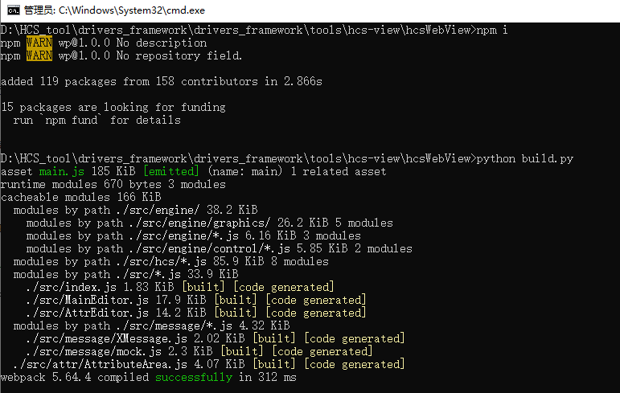
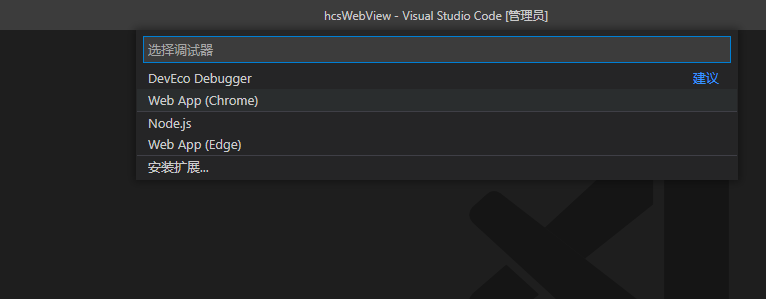
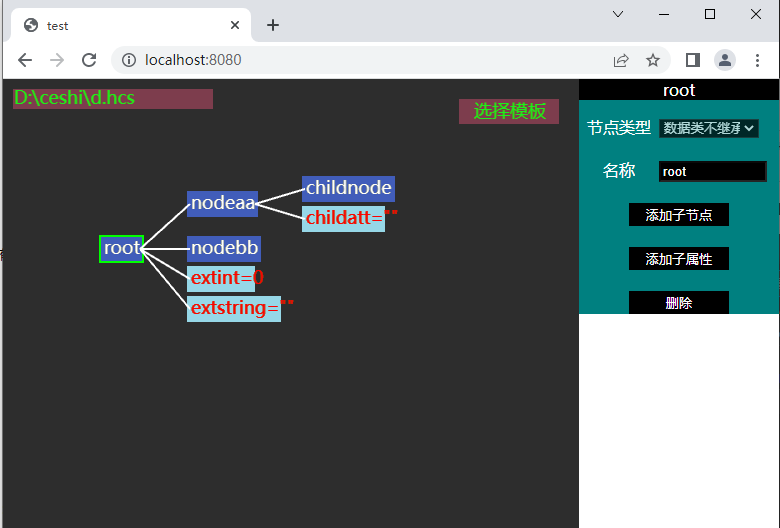
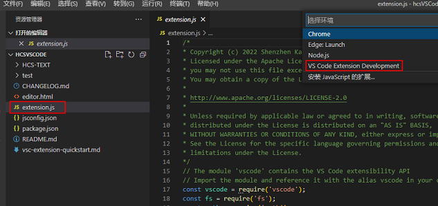
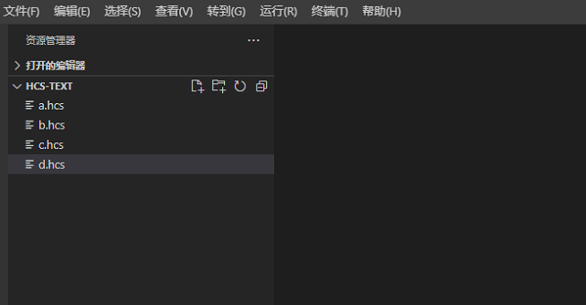
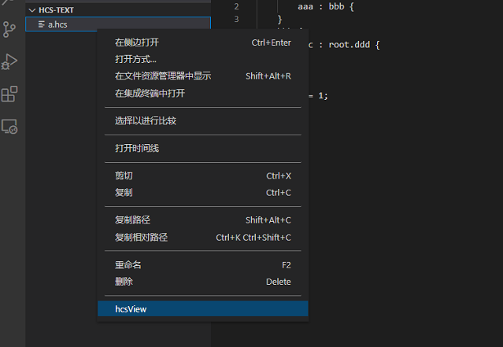

# HCS可视化工具开发调试说明
## 简介

HCS可视化工具支持HCS文件预览与编辑，具有可视化配置与HCS文件内容双向绑定、同步更新展示的优点。
工具代码文件说明如下：
			
            ├── hcs-view
                ├── ......             # 图片文件               
                ├── hcsVSCode          # VSCode工程代码，用于hcs文件与hcsWebView之间传递数据
                ├── hcsWebView         # hcs可视化处理WebView源码，用于界面的绘制呈现等处理
                │    ├── src           # hcs源码 
                │    └── test          # 工具单元测试用例 
                ├── ......             # 其他文件
                └── README_zh.md       # 工具使用说明文档

## 工具介绍

通过HCS可视化工具，使用者能够以可视化的方式对新增或已有的hcs文件，进行预览、编辑等操作，不需要在配置文件中进行节点属性预览、编辑。

## hcsWebView调试说明

### 说明

visual studio code 版本需1.62.0及以上。

### 调试说明

#### 安装依赖

1.右键windows开始菜单，单击运行，输入cmd，单击确定。

2.在命令行中进入到hcsWebView目录下，安装依赖库，命令如下：

		npm i

#### 运行脚本

1.修改启动方式，将hcsWebView目录下build.py文件内容修改为以下代码，其他代码注释掉。

		import os
		os.system("npx webpack --mode=development")

2.命令行进入hcsWebView目录下，运行build.py文件更新本地代码，运行成功后命令行中显示“successfully”，表示代码更新成功，如下图所示：

#### 启动服务

命令行进入hcsWebView目录下，启动8080端口服务，命令如下：

	D:\HCS_tool\drivers_framework\drivers_framework\tools\hcs-view\hcsWebView>python -m http.server 8080
	Serving HTTP on :: port 8080 (http://[::]:8080/) ...

#### 运行工程

VS Code中，点击文件->打开文件夹，找到hcsWebView工程所在路径，打开工具代码。按下键盘F5，选择Chrome，生成launch.json文件。

#### html可视化编辑

再次按下键盘F5，即可打开mock调试网页，如下图所示：

## hcsWebView & hcsVSCode联调说明

### 说明
visual studio code 版本需1.62.0及以上。

### 调试说明

#### 安装依赖

1.右键windows开始菜单，单击运行，输入cmd，单击确定。

2.在命令行中进入到hcsVSCode目录下，安装依赖库，命令如下：

		npm i

3.在命令行中进入到hcsWebView目录下，安装依赖库，命令如下：

		npm i

#### 运行脚本

首次使用工具或本地代码有更新时，需运行hcsWebView目录下build.py文件更新本地代码，运行成功后命令行中显示“replaced”，表示代码更新成功，如下图所示：

#### 运行工程

VS Code中，点击文件->打开文件夹，找到hcsVSCode工程所在路径，打开工具代码。然后左侧导航栏选中extension.js文件，按下键盘F5键，选择“VS Code Extension Development”环境运行工程，即可打开编辑hcs文件新窗口，如下图所示：

#### VSCode可视化编辑

VSCode新窗口弹出后，选中将要编辑的hcs文件，右键点击“hcsView”，可打开HCS文件对应的可视化配置窗口，便可进行预览或编辑节点等操作。

注意：若新窗口打开文件列表为空，可在VS Code中左上角点击文件->打开文件夹，选择正确的hcs文件。

## 注意

暂无
