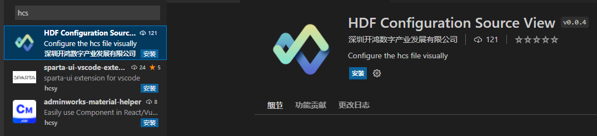
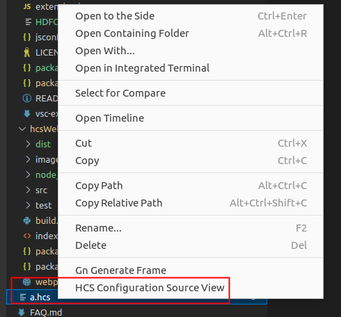

# HCS可视化工具使用说明

## 简介

HCS可视化工具支持HCS文件预览与编辑，具有可视化配置与HCS文件内容双向绑定、同步更新展示的优点。

## 工具介绍

通过HCS可视化工具，使用者可在hcs-view\examples目录下新增或添加已有的hcs文件，通过编辑hcs文件打开配置节点UI图，进行预览、编辑等操作。HCS可视化工具的软件架构如下：

## VS Code插件使用方法

### 说明
visual studio code 版本需1.62.0及以上。

下面地址中下载hcsView_output.zip，解压即可得到工具使用插件。

[工具下载链接](http://ftp.kaihongdigi.com:5000/fsdownload/QnB83qj3Q/hcsView-0.0.1)

### 步骤

1.打开VS Code，在左侧边栏中选择插件安装。

2.搜索框中输入hcs关键字，查找到插件，进行安装。

3.安装完成后，找到需要编辑的hcs文件，鼠标单击右键选择“HCS Configuration Source View”，例如：

5.以上步骤操作成功后，即可打开可视化节点配置窗口，例如：

## 注意

暂无
